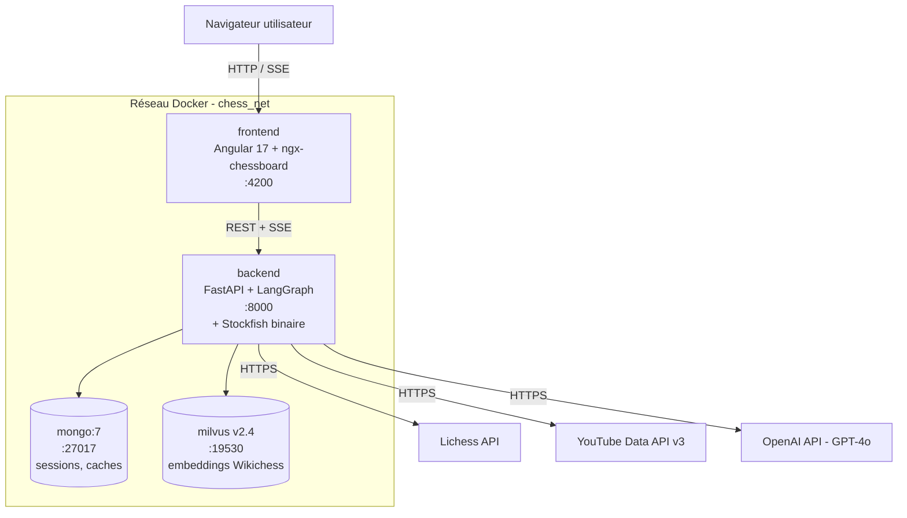
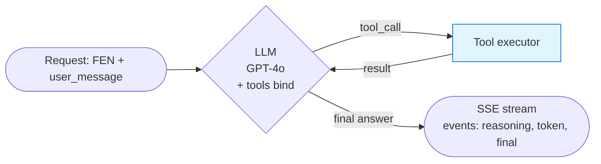

# Architecture — Chess Agent POC FFE

POC d'un agent IA d'apprentissage des ouvertures aux échecs, commandé par la Fédération Française des Échecs en vue des championnats d'Europe jeune. Mission OpenClassrooms (track AI Engineer), 2 semaines, livraison via démo locale `docker compose`.

Ce document décrit l'architecture en 6 vues complémentaires (système, backend en couches, agent, données, contrats d'API, frontend). Les décisions structurantes sont résumées juste en-dessous.

## Décisions clés

| # | Décision | Choix |
|---|---|---|
| 1 | Architecture agent | Pure agentique (LangGraph + LLM tool-calling) |
| 2 | LLM | **GPT-4o** (OpenAI) |
| 3 | Forme du graphe | **ReAct** standard (`create_react_agent`) |
| 4 | Streaming reasoning trace | **SSE** (Server-Sent Events) via `astream_events` |
| 5 | State management Angular | **Signals** (Angular 17+) |
| 6 | Stockfish | binaire embarqué dans l'image backend |
| 7 | Source théorie d'ouvertures | **chessdb.cn** (Lichess Explorer indisponible depuis fév 2026) |
| 8 | Embeddings RAG | **OpenAI `text-embedding-3-large`** (3072 dim, 8192 tokens de contexte) |
| 9 | Responsive | desktop only (POC) |
| 10 | Source du corpus RAG | **Wikipedia EN** en substitution de Wikichess (voir [note ci-dessous](#source-du-corpus-rag--wikichess--wikipedia)) |

## Périmètre fonctionnel

**MVP — must-have** : mode exploration libre. L'utilisateur joue les deux couleurs sur un échiquier, à chaque coup l'agent réagit dans un panneau latéral (chat libre + chaîne de raisonnement visible en temps réel).

**Stretch — only if time** : mode contre bot Stockfish bridé.

**Out of scope** : multi-niveaux de bots, profils joueur, ELO, time control, écrans fin de partie, multi-utilisateurs, auth, mobile.

---

## Vue 1 — Système / Infra



Services orchestrés par `docker-compose.yml` :

| Service | Image | Rôle | Port (host:container) | Volume |
|---|---|---|---|---|
| `backend` | build `./backend` (python:3.11-slim) | FastAPI + LangGraph agent + Stockfish | `8000:8000` | bind code en dev |
| `mongo` | `mongo:7` | sessions, caches Lichess/Stockfish/YouTube | `27017:27017` | `mongo_data:/data/db` |
| `milvus` | `milvusdb/milvus:v2.4-standalone` | vecteurs Wikichess | `19530:19530` | `milvus_data:/var/lib/milvus` |
| `frontend` | build `./frontend` (node:20-alpine) | Angular dev server (HMR) | `4200:4200` | bind source pour HMR |

**Stockfish** est embarqué comme binaire dans l'image `backend` (`apt-get install stockfish`). C'est un binaire CLI piloté par python-chess via UCI, pas un service réseau — un container séparé n'apporte rien.

**Réseau** : un seul bridge `chess_net`. Le backend joint Mongo/Milvus par leur nom de service (`mongo:27017`, `milvus:19530`).

**Variables d'environnement** (`.env` / `.env.example`) :

```
BACKEND_PORT=8000
MONGO_URI=mongodb://mongo:27017
MONGO_DB=chess_agent
MILVUS_HOST=milvus
MILVUS_PORT=19530
LICHESS_API_BASE=https://lichess.org/api
YOUTUBE_API_KEY=...
OPENAI_API_KEY=...
LLM_MODEL=gpt-4o
STOCKFISH_PATH=/usr/games/stockfish
LOG_LEVEL=INFO
```

---

## Vue 2 — Backend en couches

Architecture en 5 couches, indépendance stricte (les couches inférieures ne connaissent pas les supérieures) :

```
backend/
├── app/
│   ├── main.py                    # FastAPI app, CORS, lifespan, mount routers
│   ├── config.py                  # Pydantic Settings, lit .env
│   ├── api/                       # COUCHE 1 — HTTP / FastAPI routers
│   │   ├── healthcheck.py         # GET  /api/v1/healthcheck
│   │   ├── agent.py               # POST /api/v1/agent/chat (endpoint principal, SSE)
│   │   ├── moves.py               # GET  /api/v1/moves/{fen}
│   │   ├── evaluate.py            # GET  /api/v1/evaluate/{fen}
│   │   ├── vector_search.py       # GET  /api/v1/vector-search?q=...
│   │   └── videos.py              # GET  /api/v1/videos/{opening}
│   ├── agent/                     # COUCHE 2 — orchestration LLM
│   │   ├── graph.py               # build_graph() → LangGraph compilé
│   │   ├── prompts.py             # SYSTEM_PROMPT
│   │   └── tools.py               # tools exposés au LLM (wrappers sur services)
│   ├── services/                  # COUCHE 3 — logique métier
│   │   ├── chessdb.py             # client chessdb.cn (source théorie active)
│   │   ├── lichess.py             # client Lichess (préservé, à réactiver)
│   │   ├── stockfish_engine.py    # wrapper Stockfish UCI via python-chess
│   │   ├── youtube.py             # client YouTube Data API v3
│   │   └── wikichess.py           # ingestion + recherche vectorielle
│   ├── repositories/              # COUCHE 4 — accès données
│   │   ├── mongo.py               # client Motor + collections
│   │   └── milvus.py              # client pymilvus + schéma collection
│   ├── models/                    # COUCHE 5 — DTOs Pydantic
│   │   ├── chess.py               # FEN, Move, Position
│   │   └── agent.py               # ChatRequest, ReasoningStep, ChatFinalResponse
│   └── core/
│       ├── logging.py
│       └── errors.py
├── tests/
│   ├── unit/
│   └── integration/
├── Dockerfile
├── requirements.txt
└── .dockerignore
```

**Règles de dépendance** :
- `api/` orchestre, ne contient pas de logique → délègue à `agent/` (pour `/agent/chat`) ou directement à `services/` (pour les endpoints simples).
- `agent/tools.py` = wrappers fins qui appellent `services/`. Les services restent indépendants de LangGraph (réutilisables).
- `services/` ne connaissent ni FastAPI ni LangGraph. Ils prennent des inputs typés et renvoient des outputs typés.
- `repositories/` = la seule couche qui parle aux DBs.
- `models/` = pure data.

---

## Vue 3 — Agent LangGraph



### État partagé

`create_react_agent` gère lui-même l'état (`messages: list[BaseMessage]` — HumanMessage, AIMessage avec `tool_calls`, ToolMessage). Le reasoning trace n'est pas stocké en état : on l'extrait à la volée depuis le flux d'events de `astream_events` et on l'émet en SSE.

À chaque invocation, le caller passe :

```python
inputs = {
    "messages": [
        SystemMessage(content=SYSTEM_PROMPT),
        HumanMessage(content=f"Position (FEN): {fen}\n"
                             f"Historique: {move_history}\n"
                             f"Question: {user_message or 'Que penses-tu de cette position ?'}")
    ]
}
```

Le `SYSTEM_PROMPT` cadre l'agent : tutoiement, public junior chess, encourager la curiosité, appeler `lichess_opening_lookup` en premier sur une position d'ouverture.

### Construction du graphe (`backend/app/agent/graph.py`)

```python
from langgraph.prebuilt import create_react_agent
from langchain_openai import ChatOpenAI
from .tools import (
    lichess_opening_lookup, stockfish_evaluate,
    wikichess_search, youtube_search,
)
from .prompts import SYSTEM_PROMPT

llm = ChatOpenAI(model="gpt-4o", temperature=0)
TOOLS = [lichess_opening_lookup, stockfish_evaluate, wikichess_search, youtube_search]
agent = create_react_agent(llm, tools=TOOLS, prompt=SYSTEM_PROMPT)
```

### Tools exposés (4)

```python
@tool
def opening_theory_lookup(fen: str) -> dict:
    """Renvoie les coups théoriques connus pour une position donnée."""
    # Source actuelle: chessdb.cn (l'API Lichess Explorer étant down depuis fév 2026)
    # → {source, moves: [{san, uci, score_centipawns, rank, note, winrate}], opening_name, eco}

@tool
def stockfish_evaluate(fen: str, depth: int = 15) -> dict:
    """Évalue une position avec Stockfish, renvoie le meilleur coup et le score."""
    # → {best_move, score_centipawns, mate_in?}

@tool
def wikichess_search(query: str, top_k: int = 3) -> list[dict]:
    """Recherche sémantique dans la base Wikichess (RAG Milvus)."""
    # → [{text, opening_name, source_url, score}]

@tool
def youtube_search(opening_name: str) -> list[dict]:
    """Cherche des vidéos YouTube pertinentes sur l'ouverture."""
    # → [{title, video_id, channel, duration}]
```

---

## Vue 4 — Modèle de données

### MongoDB (`chess_agent` db)

**`sessions`** — une session = une partie d'exploration de l'utilisateur.
```json
{
  "_id": "uuid-v4",
  "created_at": "2026-05-07T10:00:00Z",
  "updated_at": "...",
  "current_fen": "rnbqkbnr/pp...",
  "move_history": [{"san": "e4", "fen": "...", "ts": "..."}],
  "agent_messages": [
    {"role": "user", "content": "...", "ts": "..."},
    {"role": "assistant", "content": "...", "reasoning": [...], "ts": "..."}
  ]
}
```

**`opening_theory_cache`** — TTL 7 jours, clé = FEN. Source actuelle : chessdb.cn.
```json
{ "_id": "fen-string", "source": "chessdb.cn", "moves": [...], "opening_name": null, "fetched_at": "..." }
```

**`stockfish_cache`** — TTL infini (Stockfish déterministe), clé = `fen|depth=N`.
```json
{ "_id": "fen|depth=15", "best_move": "...", "score_cp": 32, "computed_at": "..." }
```

**`youtube_cache`** — TTL 30 jours, clé = nom d'ouverture.
```json
{ "_id": "Sicilian Najdorf", "videos": [...], "fetched_at": "..." }
```

### Milvus

**Collection `wikichess_chunks`** :

| Field | Type | Notes |
|---|---|---|
| `id` | int64 (auto) | PK |
| `embedding` | FloatVector(3072) | OpenAI `text-embedding-3-large` (réductible via Matryoshka si besoin) |
| `text` | VarChar(2000) | chunk de texte |
| `opening_name` | VarChar(200) | filtre scalaire |
| `source_url` | VarChar(500) | traçabilité |
| `chunk_index` | int64 | ordre dans l'article source |

**Index** : HNSW, metric `IP` (vecteurs OpenAI déjà normalisés), params `{M: 8, efConstruction: 64}` — suffisant pour quelques centaines de chunks.

### Source du corpus RAG — Wikichess → Wikipedia

**Décision** : le corpus RAG est constitué d'articles **Wikipedia EN** d'ouvertures (18 ouvertures curées → 129 chunks), et non du site Wikichess (ficgs.com) cité par l'énoncé.

**Ce que l'énoncé autorise** : le brief OC demande *« une intégration des données issues de Wikichess dans une base Milvus pour la recherche vectorielle »* mais précise explicitement *« (toutes sources pertinentes sont acceptées) »*. La substitution est donc un choix permis, pas une déviation.

**Pourquoi pas ficgs.com Wikichess** (site inspecté avant décision) :

| Composante de Wikichess | Verdict |
|---|---|
| **Prose des articles** | Dérivée de Wikipedia (texte verbatim, ex. l'article « King's Pawn Game »). On récupère le même contenu via l'API MediaWiki, en mieux : UTF-8 (Wikichess est en latin-1), sections nettoyées, licence claire (CC BY-SA). |
| **Structure position→coups + stats** | Déjà couverte par le tool `opening_theory_lookup` (chessdb.cn : coups légaux + statistiques maîtres par FEN). Wikichess n'apporte rien de neuf ici. |
| **Volume / scrapabilité** | 268 143 pages indexées par position (`wikichess_<N>.html`), HTML legacy sans API, site affichant lui-même un bandeau « under attack ». Crawl disproportionné pour un POC de 2 semaines. |

**Conclusion** : Wikichess = prose Wikipedia + arbre de coups. Les deux composantes sont déjà disponibles chez nous via de meilleures sources (Wikipedia API pour la prose, chessdb pour les coups). Wikipedia EN est retenu pour la qualité, la licence et la stabilité d'accès.

**Réversibilité** : l'architecture est source-agnostique. Repasser à Wikichess (ou ajouter une autre source) = un changement localisé dans [`backend/scripts/fetch_wikichess.py`](../backend/scripts/fetch_wikichess.py), sans impact sur le reste du pipeline (chunking, embeddings, index Milvus, tool `wikichess_search`).

### Stratégie de cache

Tout passage par un service externe consulte d'abord Mongo. Si miss → appel API → écriture cache → retour. Cela protège des quotas (YouTube, Lichess) et accélère les démos.

---

## Vue 5 — Contrats d'API

### Endpoint principal — streamé en SSE

`POST /api/v1/agent/chat` — pilote tout l'agent. Réponse en `text/event-stream`.

**Request** :
```json
{
  "session_id": "uuid",
  "fen": "rnbqkbnr/pp...",
  "user_message": "Pourquoi e4 ici ?"
}
```

**Response (SSE)** — séquence d'events émis au fur et à mesure :
```
event: reasoning
data: {"step": "tool_call", "tool": "lichess_opening_lookup", "args": {"fen": "..."}}

event: reasoning
data: {"step": "tool_result", "tool": "lichess_opening_lookup", "result": {"opening_name": "Italian Game", ...}}

event: reasoning
data: {"step": "tool_call", "tool": "wikichess_search", "args": {"query": "Italian Game principles"}}

event: token
data: {"text": "Le coup "}

event: token
data: {"text": "e4 ouvre "}

event: final
data: {"response": "Le coup e4 ouvre les diagonales...", "suggested_moves": ["Nf3", "Bc4"]}
```

Implémentation : `agent.astream_events(...)` → on filtre les events utiles (`on_tool_start`, `on_tool_end`, `on_chat_model_stream`) → sérialisation en SSE via `StreamingResponse`.

Côté Angular : `EventSource` consomme le flux, met à jour les Signals `reasoningSteps` et `currentResponse` en live.

### Endpoints individuels

Exposés en REST classique pour validation OC, debug et fallback front :

- `GET /api/v1/healthcheck` → `{"status": "ok"}`
- `GET /api/v1/moves/{fen}` → délègue à `services/chessdb.py` (théorie d'ouvertures)
- `GET /api/v1/evaluate/{fen}?depth=15` → délègue à `services/stockfish_engine.py`
- `GET /api/v1/vector-search?q=...&top_k=3` → délègue à `services/wikichess.py`
- `GET /api/v1/videos/{opening}` → délègue à `services/youtube.py`

---

## Vue 6 — Frontend Angular

### Structure composants

```
frontend/src/app/
├── core/
│   ├── services/
│   │   ├── agent.service.ts         # client /agent/chat (SSE)
│   │   ├── chess.service.ts         # logique board (FEN, validation)
│   │   └── session.service.ts       # gère session_id (localStorage)
│   └── models/                      # interfaces TypeScript
├── features/
│   ├── board/
│   │   └── board.component.ts       # ngx-chessboard wrapper
│   ├── agent-panel/
│   │   ├── agent-panel.component.ts # panneau de droite
│   │   ├── reasoning-trace.component.ts
│   │   └── chat-input.component.ts
│   └── exploration-page/
│       └── exploration-page.component.ts  # SPA route /
└── app.component.ts
```

### Pattern Signals (`agent.service.ts`)

```typescript
@Injectable({providedIn: 'root'})
export class AgentService {
  reasoningSteps = signal<ReasoningStep[]>([]);
  currentResponse = signal<string>('');
  isStreaming = signal<boolean>(false);

  chat(fen: string, userMessage?: string) {
    this.reasoningSteps.set([]);
    this.currentResponse.set('');
    this.isStreaming.set(true);
    const es = new EventSource(/* URL avec params */);
    es.addEventListener('reasoning', (e) =>
      this.reasoningSteps.update(s => [...s, JSON.parse(e.data)])
    );
    es.addEventListener('token', (e) =>
      this.currentResponse.update(r => r + JSON.parse(e.data).text)
    );
    es.addEventListener('final', () => {
      this.isStreaming.set(false);
      es.close();
    });
  }
}
```

Les composants consomment via `service.reasoningSteps()` directement dans le template (pas besoin de `async` pipe).

---

## Volet stratégique (étude, pas à coder)

Système avancé d'indexation vidéo via vision board→FEN exposé en serveur **MCP**, livrable séparé :
- Note 8-10 pages (bénéfices/limites).
- Schéma d'architecture technique.
- Étude de faisabilité avec estimation des coûts (build + opex).
