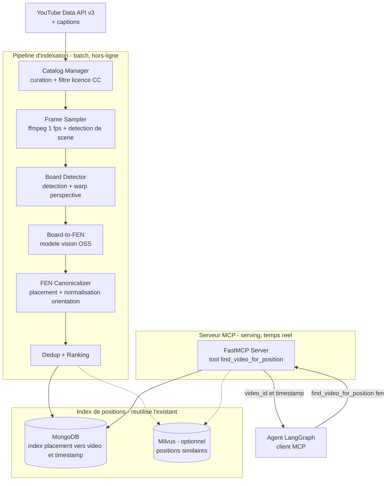
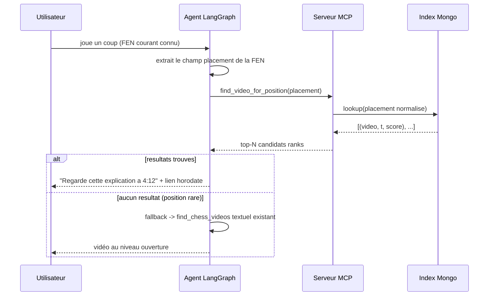
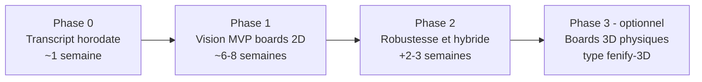

# Étude de faisabilité — Indexation vidéo par position (board-to-FEN) exposée en serveur MCP

**Projet** : Chess Agent — POC FFE · Volet stratégique (étude, non implémentée)
**Auteur** : IA Engineer junior · **Date** : 2026-05-27
**Commanditaire** : Alan (responsable technique) / Fédération Française des Échecs

> Livrable en trois parties, conformément à la demande :
> 1. Note sur les **bénéfices attendus et les limites** du système.
> 2. **Schéma d'architecture technique** de la solution MCP.
> 3. **Étude de faisabilité** avec estimation des coûts (build + opex), comparatif self-host vs cloud.

---

## Résumé exécutif

Le POC propose aujourd'hui des vidéos via une **requête textuelle** sur l'API YouTube (cf. [`services/youtube.py`](../backend/app/services/youtube.py), tool `find_chess_videos`). Limite identifiée par Alan : on renvoie une vidéo de 45 min sur la Sicilienne là où l'utilisateur veut juste l'explication **du coup en cours**.

Le système étudié indexe les vidéos **par position d'échiquier** : extraction de frames → détection d'échiquier → conversion en FEN par vision → index `position → (vidéo, timestamp)`. On peut alors répondre par un **deep-link horodaté** pointant exactement là où la position est expliquée. Le tout est exposé en **serveur MCP** (Model Context Protocol) pour être consommé par l'agent — et réutilisable par d'autres outils FFE.

**Trois conclusions de l'étude :**

1. **La faisabilité technique est réelle mais conditionnée à la qualité de la vision.** Les tutoriels échecs montrent majoritairement des **échiquiers 2D numériques** (Lichess, chess.com, ChessBase), cas le plus favorable au board-to-FEN. L'état de l'art sur board **3D physique** (`notnil/fenify-3D`) plafonne à ~95 % de précision *par case* — soit < 4 % de boards parfaits (cf. §3). La difficulté n'est ni le compute ni le stockage, c'est la **précision par échiquier**.
2. **Le coût dominant est l'ingénierie, pas l'infrastructure.** Le compute board-to-FEN se chiffre en **dizaines d'euros** pour indexer des centaines d'heures de vidéo. Le build représente **~20–30 k€** de charge d'ingénierie ; l'opex en régime permanent est dominé par la **maintenance humaine**, pas par les serveurs.
3. **Un risque juridique (CGU YouTube) doit être traité en amont**, et une **alternative beaucoup moins chère** (recherche par *transcript* horodaté) capture ~70 % de la valeur pour ~10 % du coût. Recommandation : **Phase 0 transcript-first**, puis vision en Phase 1.

| # | Décision recommandée | Choix |
|---|---|---|
| 1 | Périmètre vision Phase 1 | Échiquiers **2D numériques** uniquement (≈ 80 % du corpus tuto) |
| 2 | Modèle board-to-FEN | **Open-source** (chesscog / fenify-3D / YOLO + classifieur), fine-tuning léger seulement si les métriques l'exigent |
| 3 | Clé d'index | **Placement des pièces** normalisé en orientation (un frame ne révèle pas le trait, le roque, l'en-passant) |
| 4 | Stockage | **Métadonnées seulement** (jamais la vidéo) → réutilise Mongo/Milvus existants |
| 5 | Compute de traitement | **GPU cloud spot à la demande** (batch ponctuel), serving sur le VPS existant |
| 6 | Conformité | Restreindre au filtre **Creative Commons** + transcript via API officielle |
| 7 | Stratégie de déploiement | **Phase 0 transcript** (quick win) → **Phase 1 vision MVP** → Phase 2 robustesse |

---

## 1. Contexte et problème

### 1.1 L'existant

Le tool `find_chess_videos(opening_name)` enrichit le nom d'ouverture (`"{opening} chess opening tutorial"`) et interroge YouTube Data API v3 en filtrant sur `videoDuration=medium` et `relevanceLanguage=en`. Il renvoie une liste de vidéos pertinentes **au niveau de l'ouverture**, pas de la position.

### 1.2 La limite

La granularité est l'**ouverture**, pas la **position**. Conséquences :

- **Sur-couverture** : une vidéo de 45 min sur la Sicilienne est « pertinente » pour 40 positions différentes, mais l'utilisateur en veut une.
- **Pas de point d'entrée temporel** : l'utilisateur doit scruber manuellement la vidéo pour trouver le moment où *sa* position est traitée.
- **Pertinence textuelle floue** : le matching repose sur le titre/description, pas sur le contenu visuel réel de la vidéo.

### 1.3 La cible

Répondre à la question : *« Quelle vidéo explique CETTE position précise, et à quel instant ? »* — par un lien `https://youtube.com/watch?v=<id>&t=<sec>s` qui place l'utilisateur exactement au bon endroit.

---

## 2. Bénéfices attendus

| Bénéfice | Description | Valeur pédagogique |
|---|---|---|
| **Deep-link horodaté** | Renvoi à la seconde près où la position est expliquée | L'élève voit immédiatement l'explication utile, pas 45 min de vidéo |
| **Pertinence par position** | Matching sur le contenu visuel réel, pas sur des mots-clés | Élimine les faux positifs « bon titre, mauvais contenu » |
| **Actif réutilisable** | Le catalogue indexé s'enrichit dans le temps et se partage | Capitalisation FFE : utilisable par d'autres outils via MCP |
| **Découplage via MCP** | Capacité exposée comme outil standard | L'agent (et tout futur client MCP) consomme `find_video_for_position(fen)` sans connaître la tuyauterie vision |
| **Complément, pas remplacement** | Cohabite avec la recherche textuelle existante | Fallback naturel quand la position est trop rare pour être indexée |

> **Note de cadrage** : le système **augmente** le tool existant, il ne le remplace pas. Les positions très rares (hors corpus) retombent sur la recherche textuelle ; les positions très communes (départ, après 1.e4) nécessitent un *ranking* pour ne pas noyer l'utilisateur (cf. §6).

---

## 3. État de l'art — détection d'échiquier et board-to-FEN

Deux familles d'approches coexistent selon que l'échiquier est **2D (numérique)** ou **3D (physique)**. La distinction est structurante : les tutoriels échecs sont massivement 2D, le cas le plus favorable.

### 3.1 Détection 2D (échiquier numérique)

Board 2D = capture d'écran Lichess, chess.com, ChessBase. Cas facile : grille régulière, frontale, sans occlusion ni perspective.

| Projet / technique | Approche | Pertinence |
|---|---|---|
| **OpenCV (classique)** | Détection de lignes (Hough) / coins → découpe en 64 cases → petit CNN par case | Robuste sur board 2D net, rapide, pas de GPU pour la détection de grille |
| **tensorflow-chessbot** | CNN par case sur screenshots (Reddit/forums) | Référence OSS du 2D, très haute précision sur boards propres |
| **chesscog** | Pipeline académique (détection coins + classification pièces) sur photos | ~93–95 % par board sur photos réelles, bon compromis |

Caractéristique commune : **segmentation en 64 cases puis classification case par case**. Très efficace en frontal, fragile dès que la perspective s'incline.

### 3.2 Détection 3D (échiquier physique) — `notnil/fenify-3D`

La ressource pointée par l'énoncé ([github.com/notnil/fenify-3D](https://github.com/notnil/fenify-3D), **MIT, Python**). Convertit une photo d'échiquier **physique sous angle quelconque** en FEN, sans vue top-down. Étude de cas directement transposable.

**Approche** (distincte du 2D) :
- **End-to-end** : le modèle infère les 64 cases **directement depuis l'image entière** du board, sans segmentation préalable → tolère angles larges et occlusion, mais entraînement plus difficile.
- **Modèle** : `EfficientNetV2_S` + couche linéaire 64×13, softmax par case (ResNet50 n'a pas convergé). Stack **PyTorch / TorchVision / Lightning**.
- **Loss multi-tâches « crédit partiel »** : piece sets emboîtés (Binary → Colors → ColorBlind → Full) pour lisser le gradient d'apprentissage.

**Données (le vrai coût)** :
- **30 000 images synthétiques** générées sous **Unity** (8 sets de board × 5 sets de pièces, randomisation caméra / lumière / fond).
- **9 505 images crowdsourcées** via **Mechanical Turk** (~150 contributeurs, 4 vues par board, flip horizontal en augmentation).
- Coût MTurk : **~1 550 $**, **~120 heures** d'effort humain cumulé. ~75 % des soumissions étaient des images stock à rejeter → QA lourde.

**Entraînement** : 2 phases (~100 epochs, ~17 h) sur **un seul GPU V100** (Colab).

**Précision (validation, même distribution que l'entraînement)** :

| Piece set | Précision *par case* |
|---|---|
| Binary (vide / pièce) | 0,999 |
| Colors | 0,974 |
| ColorBlind | 0,974 |
| **Full (13 classes)** | **0,950** |

→ ~95 % par case, **~3,2 cases fausses sur 64** en moyenne. L'auteur signale lui-même un risque de **généralisation** (≈ ¼ des données viennent d'un même environnement).

> **Leçon n°1 (précision)** : `0,950⁶⁴ ≈ 3,7 %`. Même à 95 % par case, **moins de 4 % des boards sont parfaitement reconstruits**. Le board-to-FEN 3D convient à la *transcription tolérante* (≤ 2 cases d'erreur), pas au *matching exact de position*. D'où notre choix de viser le **2D numérique** en Phase 1 (précision par case ≥ 99,9 % atteignable → ~94 % de boards parfaits, car `0,999⁶⁴ ≈ 0,94`).

> **Leçon n°2 (coût)** : le build d'un système 3D est dominé par la **constitution du dataset** (simulateur Unity + ~1 550 $ MTurk + ~120 h humaines), **pas** par le GPU (~17 h V100 ≈ quelques euros). Cela valide l'analyse de coûts du §7 : l'ingénierie et la donnée dominent, le compute est marginal.

### 3.3 Choix pour ce projet

| Critère | 2D numérique (Phase 1) | 3D physique (fenify-3D, Phase 3) |
|---|---|---|
| Source typique | Tutoriels Lichess / chess.com | Footage OTB, échiquier réel |
| Précision par case atteignable | ≥ 99,9 % | ~95 % (état de l'art) |
| Boards parfaits | ~94 % | < 4 % |
| Coût dataset | faible (boards synthétiques triviaux) | élevé (Unity + MTurk) |
| **Verdict** | **retenu Phase 1** | optionnel, seulement si besoin avéré |

---

## 4. Architecture technique (solution MCP)

Le système se scinde en **deux sous-systèmes découplés** : un **pipeline d'indexation hors-ligne** (batch) et un **serveur MCP en ligne** (serving). C'est la séparation clé : l'indexation est lourde mais ponctuelle ; le serving est léger et temps réel.

### 4.1 Vue d'ensemble



### 4.2 Pipeline d'indexation (hors-ligne)

| Étape | Rôle | Technologie | Note |
|---|---|---|---|
| **Catalog Manager** | Sélectionne les vidéos à indexer, filtre par licence | YouTube Data API v3 (`videoLicense=creativeCommon`) | Conformité CGU (§6.2) |
| **Frame Sampler** | Décode et échantillonne les frames | `ffmpeg` à 1 fps + détection de changement de scène | L'échiquier ne change qu'à chaque coup → on déduplique fortement |
| **Board Detector** | Localise l'échiquier dans le frame, redresse la perspective | OpenCV (détection de lignes/coins) ou YOLO | Sur board 2D : trivial ; sur board 3D physique : difficile |
| **Board-to-FEN** | Classe les 64 cases → placement des pièces | Modèle OSS (chesscog, tensorflow-chessbot pour le 2D ; fenify-3D pour le 3D) | Cœur technique et principal facteur de risque |
| **FEN Canonicalizer** | Normalise le placement (orientation), produit la clé d'index | python-chess | Un frame ne donne que le **placement** (cf. §6.1) |
| **Dedup + Ranking** | Fusionne positions identiques, attribue un score de pertinence | Logique métier | Durée d'affichage, autorité de la chaîne, qualité vidéo, récence |

### 4.3 Serveur MCP (en ligne)

Exposé via **FastMCP** (framework Python MCP). Il ne fait **pas** de vision : il sert l'index pré-construit.

```python
# Esquisse — serveur MCP (non implémenté)
from fastmcp import FastMCP

mcp = FastMCP("chess-video-index")

@mcp.tool()
def find_video_for_position(placement_fen: str, max_results: int = 3) -> list[dict]:
    """Trouve les vidéos qui montrent CETTE position, avec timestamp précis.

    Args:
        placement_fen: champ placement de la FEN (1er champ), orientation normalisée.
        max_results: nombre de candidats à renvoyer.

    Returns:
        [{video_id, url, timestamp_s, opening_name, confidence, channel}]
        triés par score de pertinence décroissant.
    """
    key = canonicalize_placement(placement_fen)
    return rank(position_index.lookup(key))[:max_results]
```

L'agent LangGraph devient un **client MCP** : le tool `find_chess_videos` actuel est complété (ou remplacé) par un appel à `find_video_for_position(fen)`. Le découplage MCP permet aussi à d'autres applications FFE de consommer la même capacité.

### 4.4 Index de positions

- **Match exact** (cas principal) : clé = placement normalisé → **index Mongo** (`db.video_positions`, clé `placement_fen`). Une position = N entrées `(video_id, timestamp_s, score)`.
- **Match approché** (optionnel, « positions proches ») : embedding de l'état du board → **Milvus** (déjà présent dans la stack). Utile pour suggérer une vidéo d'une position *voisine* quand l'exact n'existe pas.

> **Réutilisation** : aucun nouveau datastore. Mongo et Milvus sont déjà dans `docker-compose.yml`. Le volume est minuscule (cf. §7.3).

---

## 5. Flux d'une requête (serving)



---

## 6. Limites et risques

### 6.1 Limite fondamentale — la vision donne le *placement*, pas la FEN complète

Une FEN comporte 6 champs : placement, **trait**, **droits de roque**, **en-passant**, demi-coups, numéro de coup. Un frame statique ne révèle **que le placement des pièces** (et encore, sous réserve de connaître l'orientation). Le trait, le roque et l'en-passant sont **invisibles** sur une image.

**Conséquence** : la clé d'index est le **champ placement normalisé**, pas une FEN complète. C'est suffisant pour l'usage (« montre-moi une vidéo de cette position ») mais impose :
- une **normalisation d'orientation** (une vidéo peut montrer le board du côté des Noirs → image miroir) : canonicaliser ou indexer les deux orientations ;
- l'acceptation que deux positions ne différant que par le trait/roque seront fusionnées (acceptable pédagogiquement).

### 6.2 Risque juridique — CGU YouTube ⚠️

Télécharger des vidéos YouTube pour en extraire les frames **viole les CGU YouTube** (le téléchargement hors moyens officiels est interdit). C'est un **risque bloquant** à traiter avant tout build vision.

**Mitigations possibles :**
- **Filtre Creative Commons** : YouTube expose un filtre `videoLicense=creativeCommon`. Ces vidéos sont réutilisables → réduit le risque (à valider juridiquement).
- **Partenariats chaînes** : accord explicite avec quelques chaînes échecs francophones (cohérent avec la mission FFE).
- **Traitement éphémère sans stockage de la vidéo** : on ne conserve que les métadonnées (FEN → timestamp), jamais le flux vidéo — atténue mais ne supprime pas le grief du téléchargement.
- **Voie 100 % conforme** : l'alternative *transcript* (§8) passe par l'**API officielle de sous-titres**, sans téléchargement → aucun problème CGU.

### 6.3 Risques techniques (vision)

| Risque | Impact | Atténuation |
|---|---|---|
| **Flèches / surbrillances** dessinées sur le board (omniprésentes en tuto) | Faux positifs de classification de cases | Dataset d'entraînement incluant ces overlays ; détection et masquage |
| **Frames mi-coup** (animation de déplacement) | Position incohérente / illégale | Validation via python-chess (rejeter les placements illégaux) + détection de scène stable |
| **Boards 3D physiques** (footage OTB) | Précision chute fortement (~95 % par case → < 4 % de boards parfaits, cf. fenify-3D §3.2) | **Hors périmètre Phase 1** ; ne traiter que le 2D numérique |
| **Précision par échiquier** | 99,5 % par case → seulement ~73 % de boards parfaits (`0,995⁶⁴`) | Viser ≥ 99,9 % par case ; mesurer la précision *par board*, pas *par case* |
| **Sets de pièces / thèmes exotiques** | Mauvaise classification | Restreindre aux thèmes standards Lichess/chess.com en Phase 1 |

> Le calcul `0,995⁶⁴ ≈ 0,73` (et le `0,95⁶⁴ ≈ 0,037` mesuré par fenify-3D) est le point le plus contre-intuitif du dossier : une excellente précision *par case* peut donner une médiocre précision *par board*. Le harness d'évaluation doit mesurer le bon indicateur.

### 6.4 Risques produit et business

- **Cold-start** : tant que peu de vidéos sont indexées, le taux de réponse utile est faible. → Amorcer avec un catalogue curé suffisant avant d'exposer la feature.
- **Positions trop communes** : la position de départ apparaît dans des milliers de vidéos → ranking indispensable (qualité, autorité, durée d'affichage).
- **Liens morts** : vidéos supprimées/privées → revalidation périodique de l'index, sinon érosion de la confiance utilisateur.
- **Dépendance à un tiers** : tout repose sur YouTube (disponibilité, CGU, quotas, évolution de l'API). Risque business à assumer ; mitigation = catalogue multi-sources à terme.
- **ROI incertain** : la valeur dépend de l'usage réel par les jeunes joueurs → valider via la Phase 0 (peu coûteuse) avant d'investir dans la vision.

---

## 7. Étude de faisabilité chiffrée

> Tous les montants sont des **estimations** (€, 2026) destinées au cadrage, pas des devis. Les tarifs cloud/GPU évoluent.

### 7.1 Hypothèses de volumétrie

| Scénario | Vidéos | Durée moyenne | Heures totales |
|---|---|---|---|
| **Pilote** | 200 | 12 min | ~40 h |
| **Production v1** | 2 000 | 12 min | ~400 h |
| **Cible** | 10 000 | 12 min | ~2 000 h |

L'indexation est essentiellement un **batch ponctuel** (assimilable à du capex) + un **incrément** mensuel (opex) pour les nouvelles vidéos.

### 7.2 Coût de compute board-to-FEN

Hypothèses : échantillonnage 1 fps + déduplication par scène ; un détecteur + classifieur de cases traite **~1 h de vidéo en ~5–8 min** sur un GPU de classe T4/L4 (décodage CPU en parallèle).

| Scénario | GPU-heures (batch initial) | Coût cloud spot (~0,16 €/h) | Coût cloud on-demand (~0,50 €/h) |
|---|---|---|---|
| Pilote (40 h) | ~5 | **~0,80 €** | ~2,50 € |
| Production v1 (400 h) | ~50 | **~8 €** | ~25 € |
| Cible (2 000 h) | ~230 | **~37 €** | ~115 € |

> **Le compute est négligeable.** Indexer 2 000 heures de vidéo coûte quelques dizaines d'euros. Ce n'est PAS le facteur de coût. (fenify-3D confirme : ~17 h V100 pour entraîner *tout un modèle 3D* — l'inférence d'indexation est encore moins chère.)

### 7.3 Coût de stockage

On ne stocke **que des métadonnées** (placement FEN → liste de `video_id` + timestamp + score). Pour 2 000 vidéos × ~50 positions = 100 000 lignes ; même à 10 000 vidéos, < 1 Go. → **réutilise Mongo existant, coût marginal ~0 €**. Les frames extraits sont **éphémères** (jetés après inférence) ou, si conservés pour audit, ~70 Go sur object storage → **~0,70 €/mois**.

### 7.4 Coût d'API

Le système s'appuie sur l'API YouTube Data v3 (déjà utilisée par `find_chess_videos`).

| Usage | Quota / coût | Note |
|---|---|---|
| **Découverte de vidéos** (`search.list`) | **100 unités**/appel ; quota gratuit **10 000 unités/jour** → ~100 recherches/jour | Suffit pour alimenter le catalogue ; augmentation de quota gratuite sur dossier |
| **Métadonnées** (`videos.list`) | 1 unité/appel | Négligeable |
| **Sous-titres** (`captions.*`, alternative §8) | `captions.list` = 50 unités ; download officiel limité au propriétaire de la vidéo | En pratique, transcripts publics via bibliothèque tierce |
| **Modèle vision** | **0 € — modèle OSS auto-hébergé**, pas d'API vision payante | Évite tout coût récurrent par image |

> Point clé : **aucune API vision payante**. Le board-to-FEN tourne sur modèle OSS auto-hébergé. Le seul quota à surveiller est YouTube Data v3, déjà absorbé par le cache Mongo de l'app → coût API en régime permanent **~0 €** (dans le quota gratuit).

### 7.5 Coût de build (capex — charge d'ingénierie)

C'est le poste dominant.

| Lot de travail | Charge (jours-homme) |
|---|---|
| Curation catalogue + ingestion (filtre CC) | 4 |
| Pipeline extraction frames + détection de scène | 5 |
| Détection d'échiquier + intégration board-to-FEN (OSS) | 10 |
| Canonicalisation FEN (orientation, placement) + validation python-chess | 4 |
| Robustesse (flèches/surbrillances, fine-tuning léger) | 10 |
| Index positions + dedup + ranking | 6 |
| Serveur MCP (FastMCP) + tool + intégration agent | 6 |
| Harness d'évaluation accuracy (par board) + QA | 6 |
| Documentation + déploiement + CI | 3 |
| **Total** | **~54 j-h (~2,5 mois-homme)** |

À un taux journalier mixte (junior + senior) de **~450 €/j** : **~24 000 €**.
Fourchette : **18 000 € (350 €/j) – 32 000 € (600 €/j)**. Le batch de compute initial (<50 €) est négligeable devant ce poste.

> **Si dataset 3D nécessaire (Phase 3, type fenify-3D)** : ajouter le coût de constitution du dataset — simulateur Unity + ~1 550 $ de Mechanical Turk + ~120 h humaines — soit **+15 à 25 j-h et ~1 500 €** de crowdsourcing. Raison de plus pour rester en 2D en Phase 1.

> **Réduction Phase 1** : en se limitant aux boards 2D et en différant la robustesse lourde + le fine-tuning (−10 à −14 j-h), le build descend à **~34–40 j-h ≈ 15 000–18 000 €**.

### 7.6 Coût opex — comparatif self-host vs cloud managé

Régime permanent, scénario Production v1 (~+100 vidéos/mois ≈ +20 h ≈ ~3 GPU-h/mois).

| Poste mensuel | Self-host (Hetzner) | Cloud managé (AWS / GCP) |
|---|---|---|
| Compute (ré)indexation incrémentale (~3 GPU-h) | inclus si GPU dédié, **ou** instance louée à l'heure ponctuelle | spot ~0,5 € · on-demand ~1,5 € |
| GPU permanent (si serveur dédié) | GEX44 RTX 4000 Ada ~**184 €/mo** (très sous-utilisé pour 3 GPU-h) | n/a (pas de GPU permanent) |
| Hébergement serveur MCP + index | **réutilise le VPS existant : ~0 € marginal** | conteneur managé (Cloud Run / Fargate) ~15–40 € |
| Stockage métadonnées | ~0 € (Mongo existant) | ~1 € (DB / object storage managé) |
| API YouTube | ~0 € (quota gratuit) | ~0 € (quota gratuit) |
| **Sous-total infra** | **~0 € (sans GPU dédié) à 184 € (avec)** | **~16–48 €** |
| Maintenance humaine (~1–2 j/mois) | 450–900 € | 450–900 € |
| **Total opex / mois** | **~450–1 080 €** | **~470–950 €** |

**Lecture du comparatif :**
- En régime permanent, **l'infra est marginale dans les deux cas** ; le poste dominant de l'opex est la **maintenance humaine**.
- Le **GPU dédié Hetzner permanent n'est pas rentable** pour cette charge en rafales (3 GPU-h/mois pour un serveur à 184 €/mo). Il ne le devient que pour un très gros volume continu (réindexation massive régulière).
- **Recommandation** : **batch de (ré)indexation sur GPU cloud spot à la demande** (payé à l'usage, ~quelques euros/mois) **+ serving sur le VPS existant** → opex infra quasi nul, sans immobiliser de GPU.

### 7.7 Synthèse des coûts

| | Build (one-shot) | Opex (mensuel) |
|---|---|---|
| **Phase 0 — transcript (alternative §8)** | ~5–8 j-h ≈ **2 500–3 600 €** | ~maintenance seule, infra ~0 € |
| **Phase 1 — vision MVP (2D)** | ~34–40 j-h ≈ **15 000–18 000 €** | **~450–950 €** (dominé par maintenance) |
| **Phase 2 — robustesse complète** | +10–14 j-h ≈ **+5 000–6 500 €** | idem |
| **Phase 3 — vision 3D (type fenify-3D)** | + dataset Unity/MTurk ≈ **+15–25 j-h + ~1 500 €** | idem |

---

## 8. Alternatives et phasage

### 8.1 Alternative recommandée en amont — recherche par *transcript* horodaté (Phase 0)

Plutôt que la vision, exploiter les **sous-titres** des vidéos (souvent disponibles, accessibles via l'**API officielle** → **conforme aux CGU**). On indexe les segments de transcript horodatés et on matche textuellement le nom d'ouverture / la séquence de coups (« 1.e4 e5 2.Nf3 ») pour retrouver le bon instant.

| Critère | Transcript (Phase 0) | Vision board-to-FEN (Phase 1) |
|---|---|---|
| Conformité CGU | ✅ API officielle | ⚠️ téléchargement à sécuriser |
| Coût de build | ~5–8 j-h | ~34–54 j-h |
| Précision position | Moyenne (dépend de l'oralité du coach) | Élevée (contenu visuel réel) |
| Couverture | Bonne (beaucoup de vidéos sous-titrées) | Limitée par l'accuracy vision |
| Valeur capturée | **~70 %** | ~100 % |

> **C'est le « quick win » à présenter au jury** : il livre l'essentiel de la valeur (deep-link horodaté) en quelques jours, sans risque CGU ni vision. La vision vient ensuite, là où le transcript échoue (coach silencieux, position non énoncée).

### 8.2 Architecture hybride (cible)

Transcript pour le **repérage grossier** du segment → vision pour **confirmer la position exacte** sur ce segment. On ne lance la vision (coûteuse, sensible) que sur des fenêtres temporelles déjà pré-filtrées par le transcript → moins de frames, moins de faux positifs, coût réduit.

### 8.3 Étapes de développement proposées



1. **Phase 0 — Transcript (1 sem.)** : valide l'usage et le ROI du deep-link horodaté à coût minimal et 100 % conforme.
2. **Phase 1 — Vision MVP (6–8 sem.)** : board-to-FEN sur boards 2D numériques, modèle OSS, batch cloud spot, MCP server. Métrique de succès : **précision par board ≥ 90 %** sur un jeu de test représentatif.
3. **Phase 2 — Robustesse (+2–3 sem.)** : gestion flèches/surbrillances, fine-tuning, hybride transcript+vision.
4. **Phase 3 — (optionnel)** : boards 3D physiques (footage OTB) via une approche type `fenify-3D` — seulement si un besoin avéré le justifie, en assumant le coût dataset et le plafond de précision.

---

## 9. Conclusion et recommandation

Le système d'indexation par position est **techniquement faisable** et apporte une vraie valeur pédagogique (deep-link horodaté, pertinence par position). Mais :

- **Le risque n'est ni le compute ni le stockage** (négligeables) — c'est la **précision vision par échiquier** (l'état de l'art 3D, fenify-3D, plafonne à < 4 % de boards parfaits) et la **conformité CGU**.
- **Le coût réel est l'ingénierie et la donnée** : ~15–18 k€ pour un MVP vision 2D (Phase 1), dominé ensuite par la maintenance humaine, pas par l'infra. Un système 3D ajouterait un coût de dataset (Unity + MTurk) significatif.
- **Le modèle d'infra recommandé** est le **batch cloud spot + serving sur l'infra existante** : il évite d'immobiliser un GPU dédié pour une charge en rafales, et garde l'opex infra quasi nul. Le self-host dédié ne se justifie qu'à très gros volume continu.

**Recommandation finale** : commencer par la **Phase 0 transcript** (1 semaine, conforme, ~70 % de la valeur) pour valider l'usage et convaincre le commanditaire, puis investir dans la **vision Phase 1 sur boards 2D uniquement**, avec une métrique de succès claire (**précision par board ≥ 90 %**) comme porte de sortie avant d'engager la robustesse de Phase 2. Réserver la vision 3D (Phase 3) aux cas où le footage physique devient un besoin réel.

---

### Annexe — Références technologiques

- **MCP / FastMCP** : [Model Context Protocol](https://modelcontextprotocol.io), framework FastMCP (Python).
- **Board-to-FEN 3D** : [`notnil/fenify-3D`](https://github.com/notnil/fenify-3D) — EfficientNetV2_S end-to-end, dataset synthétique Unity (30 k) + crowdsourcing MTurk (9,5 k, ~1 550 $), précision Full 0,950 par case, PyTorch Lightning, **licence MIT**. Ressource citée par l'énoncé.
- **Board-to-FEN 2D (OSS)** : `tensorflow-chessbot`, `chesscog`, approches YOLO + classifieur de cases.
- **Détection d'échiquier** : OpenCV (Hough, détection de coins), redressement de perspective.
- **Validation FEN** : `python-chess` (déjà dans la stack — cf. [`services/chess_logic.py`](../backend/app/services/chess_logic.py)).
- **Tool vidéo existant** : [`services/youtube.py`](../backend/app/services/youtube.py) (`find_chess_videos`), à compléter par `find_video_for_position`.
